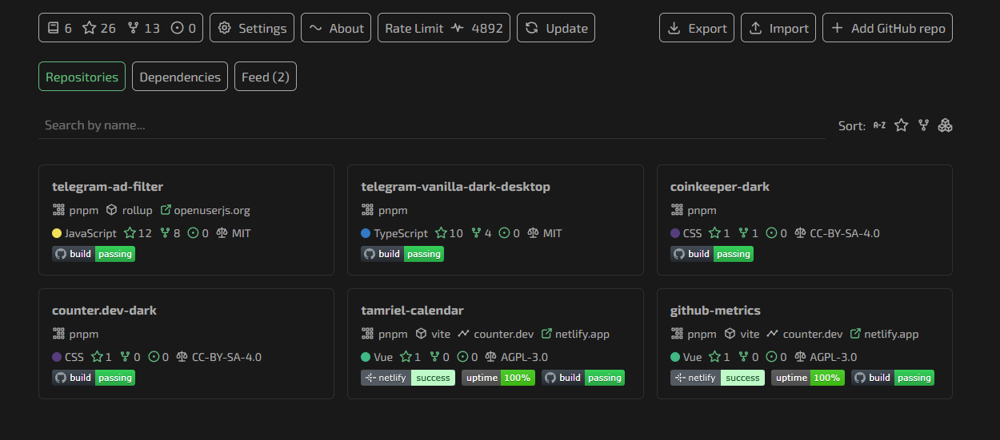
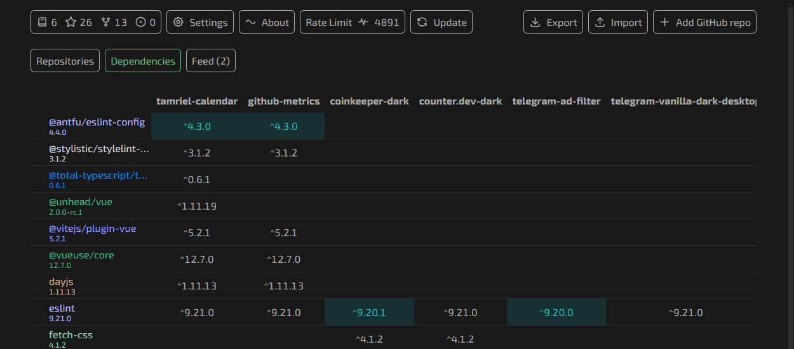
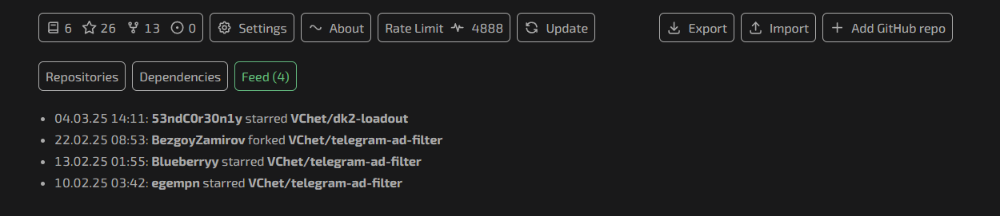

# GitHub Metrics

Discover comprehensive insights into your GitHub repositories' metrics.
Track stars, forks, and more, all conveniently stored locally.

## Preview

## Development

- Install dependencies: `pnpm install`
- Start dev-server: `pnpm run dev`
- Build for production: `pnpm run build`
